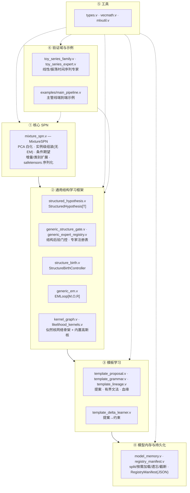
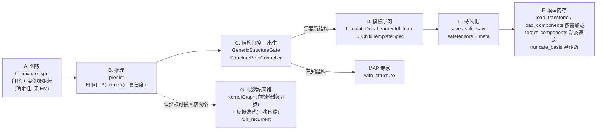

# conger

**核心通用 SPN 网络功能**（domain-independent SPN / structure-learning 内核）。

本仓库是 **通用 SPN / 结构学习内核**：MixtureSPN（全分辨率实例级浅混合 SPN：PCA 白化 + 逐 kind 分层，每样本一个对角高斯块，连续条件期望 ≡ 分层核回归，离散场景因子 ≡ 条件后验分类，无 EM、确定性）+ 通用结构学习框架（`StructuredHypothesis` / `EMLoop` / `GenericStructureGate` / `GenericExpertRegistry` / `StructureBirthController` / `KernelGraph` 似然核网络）+ 模板学习（血缘 / 文法 / 约束学习）+ 模型内存与持久化 + 纯数学 / MLX 工具 + 验证域（`ToySeries`）。内核不依赖图像、渲染等外部概念，可被任意下游项目 import。

模块 `conger` 平铺在仓库根目录，依赖经默认 V 模块目录 `~/.vmodules` 解析（符号链接到本地 [`mlx-v`](../mlx-v) 绑定）。内核架构与主管线的详细说明见 `docs/architecture.md`。

## 内核架构



依赖方向单向：核心 SPN → 结构框架 → 模板学习 → 持久化；工具层（⑤）被其余各层复用；验证域与示例（⑥）以 `ToySeries` 时间序列实例驱动核心 SPN、结构门控与出生控制，证明整套通用结构学习框架可独立运行，可被任意下游领域适配。

## 主管线

与 `examples/main_pipeline.v` 的 A→G 阶段一一对应：



## 构建与测试

```bash
make test        # v -gc boehm -no-memory-limit test .
make fmt         # v fmt -w .
```

（等价直接命令：`v -gc boehm -no-memory-limit test .`，依赖经 `~/.vmodules` 解析，无需 `VMODULES` 环境变量。）

11 个 V 测试文件全部通过（MixtureSPN 黑盒 / 模型内存 / 通用结构门控与出生控制 / 模板文法·提案 / 注册表清单往返 / 通用 EM / 模板约束学习·血缘 / 似然核网络骨架 / 内置似然核）。

## 模块（一文件一类）

核心 SPN：`mixture_spn.v`（MixtureSPN：白化 + 实例级组装 + 条件期望 + 增量 `add` / 类别 `expand_categories` / safetensors 序列化）。

通用结构学习：`structured_hypothesis.v`（泛型统一结构化假设 / 后验对象，`scene` 字段为泛型载荷 `T`，验证域用 `voidptr`）/ `generic_em.v`（域无关 EMLoop）/ `generic_structure_gate.v`（结构后验门控 + 两级 `decide_hierarchical`）/ `generic_expert_registry.v`（专家注册表 + 出生控制器挂接）/ `structure_birth.v`（未知结构出生队列与请求）/ `kernel_graph.v`（似然核网络骨架：`KernelNode` 声明前馈 `parents` 与反馈 `feedback` 连接，`topo_order` 确定性拓扑排序（仅前馈边，须为 DAG），`run_recurrent` 按拓扑序逐步推进、反馈边注入上一步输出，可自定义似然核之间的拓扑结构与反馈回路）/ `likelihood_kernels.v`（内置似然核：对角高斯 / 高斯混合 / 条件高斯（均值 = 前馈+反馈输入的线性读入，拓扑直接塑造条件似然）/ `MixtureSPNKernel`（MixtureSPN 白化特征混合对数似然适配器））。

模板学习：`template_proposal.v` / `template_lineage.v`（parent/delta 继承契约 + `ChildTemplateSpec`）/ `template_grammar.v`（有界组合文法）/ `template_delta_learner.v`（提案约束学习）。

模型内存与持久化：`model_memory.v`（split 序列化 / 按需加载 / 动态遗忘 / 基截断 / `model_size_mb`）/ `registry_manifest.v`（动态子模板与 pending spec 的 JSON 持久化）。

工具：`types.v`（类型化 `TemplateDelta` / `TemplateMetadata` / `TemplateConstraints` 约束记录）/ `vecmath.v`（纯 f64 向量原语 + 确定性 RNG）/ `mlxutil.v`（MLX 辅助：白化特征分解、复数 FFT、掩码索引等）。

验证域：`toy_series_family.v` + `toy_series_expert.v`（线性 / 振荡时间序列专家，已导出为 pub，验证 MixtureSPN、结构门控与出生控制不依赖图像等外部概念）。

测试：根目录 `*_test.v`（11 个文件）。`docs/architecture.md` — 内核架构与主管线（分层架构 + 数据/控制流总图）。

示例：`examples/main_pipeline.v` — 主管线（训练 → 推理 → 结构门控/出生 → 模板学习 → 持久化往返 → 模型内存：按需加载/动态遗忘/基截断 → 似然核网络：自定义 LikelihoodKernel + 前馈依赖 + 反馈迭代）的最小端到端演示，运行 `v -gc boehm -no-memory-limit run examples/main_pipeline.v`。

示例：`examples/iris_classification.v` — Fisher Iris 三分类（离散场景因子 ≡ 条件后验分类：`fit_mixture_spn` 训练 + `predict` 取 P(class|x) argmax，分层划分 120/30，测试准确率 96.7%），运行后还会把模型内部结构（Σ 混合根 → Π 分量 → 高斯/类别叶子）写成 mermaid DAG `examples/iris_model_dag.mmd`，运行 `v -gc boehm -no-memory-limit run examples/iris_classification.v`。

## 依赖

- [`mlx-v`](../mlx-v) — MLX C API 的 V 绑定（复数 FFT、safetensors、随机数等）。

经默认 V 模块目录 `~/.vmodules` 解析。首次在机器上配置一次符号链接即可：

```bash
ln -sfn /path/to/mlx-v  ~/.vmodules/mlx
```

之后 `v test .` / `make test` 均无需 `VMODULES` 环境变量。
