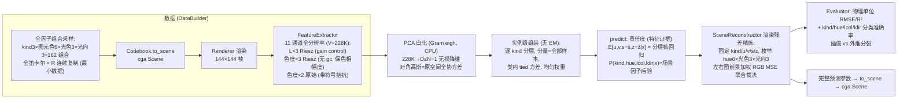
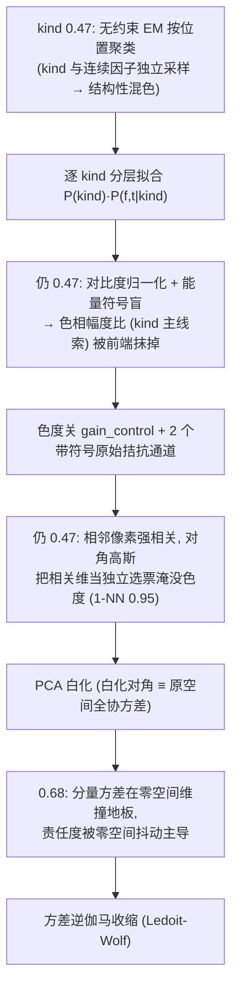
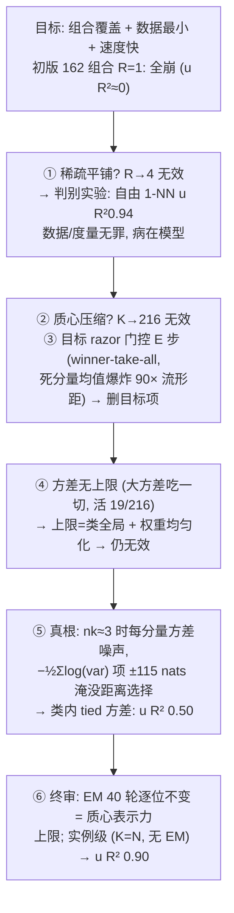
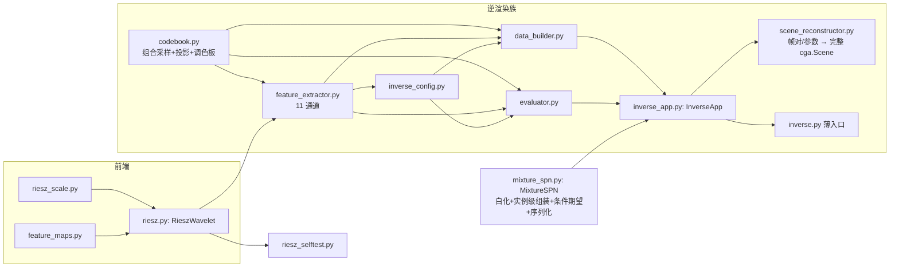
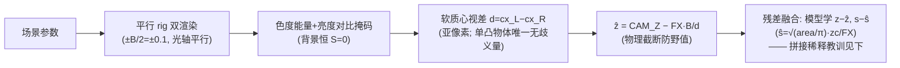

# conger 架构与流程图

SPN 逆渲染研究: 左右两张二维立体图像 → Riesz 全分辨率特征 → 完整
`cga.Scene` 重建 (含光照)。本文档是全部流程的总图 + 机制决策录; 各模块
docstring 有机制细节。

## 0. 主线切换 (2026-08-12/13)

两次退役: ① 离散场景码体系 (逐码贝叶斯/池化 SPN/码网格, 最后提交
7ae963f) —— 连续物理量的离散化只是后验求积; ② EM/质心压缩层
(提交 523b97a 的 MixtureSPN 初版) —— 小数据 + 弯曲流形下质心把点
平均到流形外, 实例级 (每样本一分量) 才是最小数据设计的正确形态。
git 历史保留全部旧实现。

现行唯一主线: 全因子覆盖连续采样 + 全分辨率实例级浅混合 SPN。

## 1. 主链路 (inverse.py)



实测 (渲染残差精炼版, N=1296): 插值 u,v RMSE 4.95/4.43px
(R² 0.930/0.945) / s R² 0.332 / z R² 0.831 / kind 0.577 / hue 0.994 /
lcol 0.972 / ldir 0.830; 外推 u,v R² 0.949/0.953 / s,z R² 0.909/0.956 /
kind 0.515 / hue 0.981 / lcol 0.861 / ldir 0.731。精炼前共享责任度的
lcol/ldir 仅 0.457/0.367; 候选重渲染把反照率×光照歧义交回正向模型,
是外观辨识的主要来源。

## 2. 机制决策录 (全部实测驱动, 按时间序)

### 2.1 特征与分层 (2026-08-12)



### 2.2 EM 的四条退化通道 → 实例级 (2026-08-13, 全因子数据重设计时)

图元色与 kind 解耦 + 光照全因子覆盖后, 逐版本实测定位:



教训沉淀: EM/质心压缩是大数据优化; 小数据 + 弯曲流形时质心把点
平均到流形外。数据均匀采样 ⟹ 均匀权重是正确先验 (学权重反而
引入 log_w≈−20 死亡螺旋)。

## 3. 渲染残差光照精炼 (SceneReconstructor)

SPN 的共享责任度擅长几何与类别近邻, 但光照只贡献弱特征差异; 让
`hue/lcol/ldir` 三个边缘后验独立 argmax, 还会把反照率×光照的联合
歧义错误拆开。精炼级改为分析-合成: 固定 SPN 估计的 kind/u/v/s/z,
枚举 6×3×3 个外观候选, 用同一 cga renderer 重渲染左右视图, 并以
前景加权 RGB MSE 选择联合 MAP:

```math
\ell(h,c,d)=\frac12\sum_{v\in\{L,R\}}
\frac{\sum_x m_v(x)\|I_v(x)-R_v(h,c,d)(x)\|^2}{\sum_x m_v(x)}
```

`m_v` 与立体前景掩码同定义 (色度能量 + 背景亮度对比)。几何误差
对所有外观候选近似同置, 不改变排序; 色相与光照则由正向模型联合
裁决。该级只替换外观三因子, 不掩盖 SPN 后验 —— 公共接口仍返回
SPN posterior 供不确定性检查。

## 4. 模块结构 (一文件一类)



依赖方向单向; codebook/feature_extractor 仅 TYPE_CHECKING 引
InverseConfig 防环。

## 5. 持久化 (safetensors)

- 数据缓存: `artifacts/mix_*.safetensors` (配置指纹文件名, gitignore);
- 模型: MixtureSPN.save/load —— 参数张量 (含白化基 basis (V,D),
  全量约 1.5GB) + rel_floor 入 JSON 明文头; Utils.st_metadata 可查;
  默认路径 `spn_full_<数据指纹>` (`full` 标记完整场景类目头输出契约)。

## 6. 待办 (按价值排序; 已对照实例级架构审判, 过时项已删)

1. **逐 kind PPCA 似然比**: kind 形状线索的度量升级 (各类自己的
   白化子空间 + log|det| 修正, 跨类密度可比化)
2. **池外光照探针**: held-out 光向/光色, 验证完整 Scene 输出的光照
   泛化与反照率×光照联合可识别性
3. **大数据逃生通道** (N~10⁴ 触发): PCA 基按内在维度截断 /
   子样本估基全量套用 / ANN 索引加速推理 / 压缩蒸馏 —— EM 若
   回归只能作实例模型的对照验证压缩件 (退化通道病历见 §2.2)

已删过时项 (2026-08-13 审判): DP-SVI 自动定 K (实例模型 K=N, 无
分量数可定) / online EM (无 EM 可 online, 需求并入逃生通道) /
熟悉尺寸先验重接 + 局部线性核回归 (单目 s/z 歧义的解法, 单目
模式已删, 立体下 s/z 由几何解决) / 参考物破解色恒常 (随遮挡
模式一起删)。

## 7. 双眼视差 (stereo.py, 2026-08-13)



实测 (全量): 视差管线 ẑ RMSE 0.35 (bias +0.30 = 可见面≠中心的系统
偏差, 残差学习标定); 融合后 z R² 0.85 / s R² 0.41
/ **外推 z R² 0.96** (几何量不饱和, 核回归边界问题在 z/s
上消解)。

踩坑记录 (全部实测): ① 角部样本 (大 s×近 z) 边距反演出画 → 空掩码
1/d 爆炸 → 采样器加取景约束拒绝采样; ② 裸 area (σ≈600) 拼特征
主导 λ 谱 → 白化截断阈值抬升误截特征方向 → 拼接维先缩放到特征
方差量级; ③ 强几何观测直接拼特征被白化稀释 (1/647 维) → 残差
参数化融合。

**增量训练** (2026-08-13): 采样逐复制块独立种子 (SAMPLE_V=3) → R
增长纯追加; 数据逐块缓存 (缺哪块渲哪块); 模型 `MixtureSPN.add`
= 冻结白化基追加分量 + tied 方差全量重估 (实例级 f_mu 即样本,
与全量 fit 同估计量)。唯一近似 = 基冻结: 新样本跑出旧主子空间
的方向不可表示, 分布漂移大时重新 fit。
