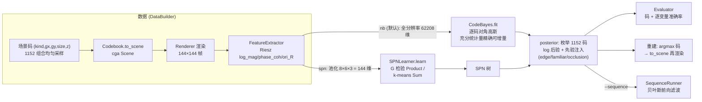
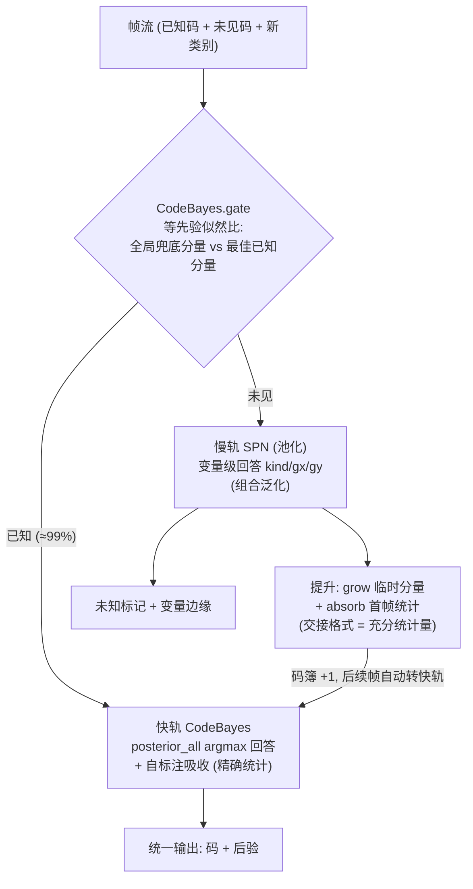
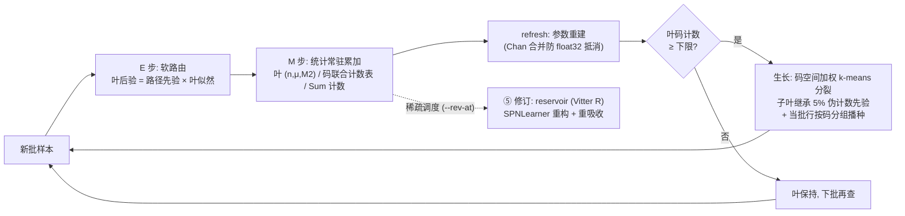
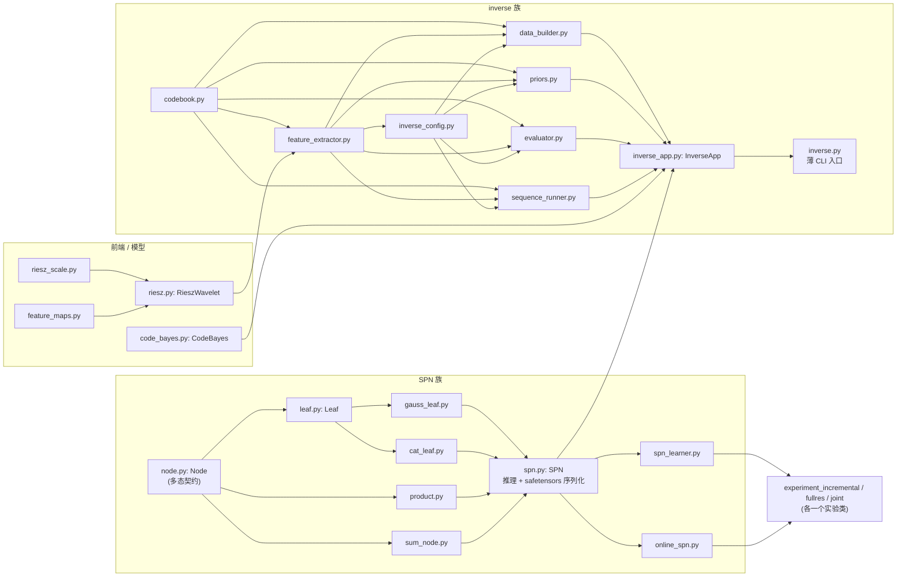
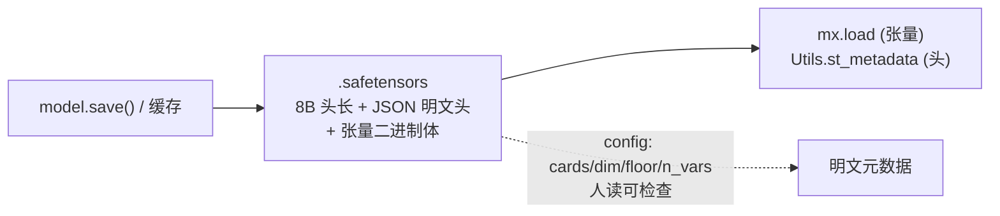

# conger 架构与流程图

SPN 逆渲染研究: cga engine 渲染合成场景 → Riesz 特征 → 反演 3D 场景码。
本文档是全部流程的总图; 各模块 docstring 有机制细节, `prior.md` 有先验体系。

## 1. 主链路: 逆渲染 demo (inverse.py)

实测: nb 码准确率 0.965 (秒级训练) / spn 0.470 (分钟级, 组合泛化研究对照)。

## 2. 开放集: 门控双轨联合系统 (experiment_joint.py)

实测: 提升覆盖 86.5% 后码 acc 0.861, 分量纯度 1.000; 码簿外新类别 (圆盘)
判新 100% 且 SPN 位置泛化 gx 0.41 / gy 0.74。

## 3. 在线学习: OnlineSPN 吸收-生长-修订 (online_spn.py)

实测 (N=4000, 5 批): 纯在线 = 全量 × 0.82; 加中途单次修订 (cap=2048)
= ×0.98 (0.460 vs 0.470), 时间省 30%+。高频修订反而 ×0.61
(证据丢失税) —— 修订要稀疏。

## 4. 模块结构 (一文件一类)

依赖方向全部单向; codebook/feature_extractor 仅 TYPE_CHECKING 引
InverseConfig 防环; 反序列化工厂 (node_from_records) 在依赖顶点 SPN。

## 5. 持久化 (safetensors)

- 数据缓存: `artifacts/*.safetensors` (gitignore);
- 模型: SPN 树扁平化 (DFS 先序 + CSR 子索引 + 分类型负载表),
  CodeBayes 平铺统计量; `.pkl` 后缀走旧 pickle 格式向后兼容。
