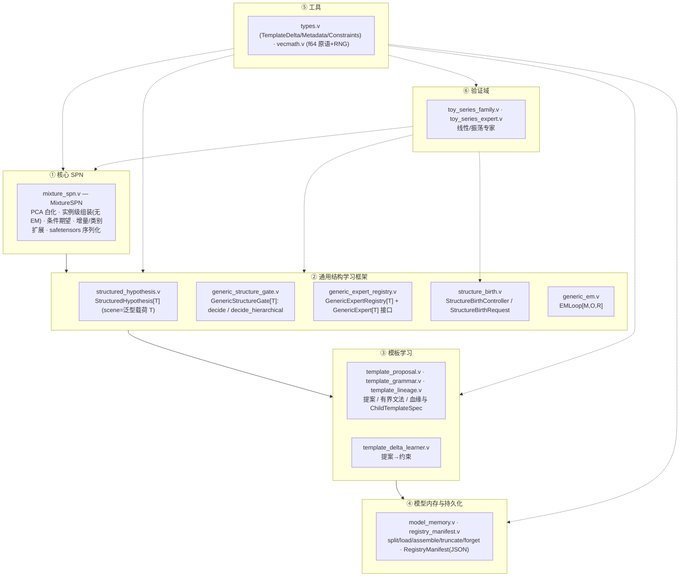
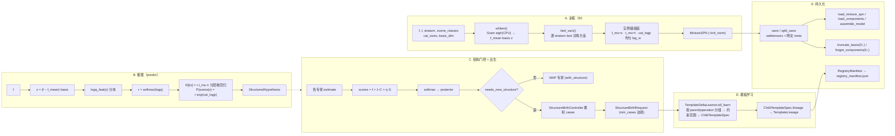

# conger 架构与流程图（内核）

> 本文档描述 `conger` 内核（模块 `conger`：MixtureSPN + 通用结构学习框架 +
> 模板学习 + 模型内存 / 持久化 + 纯数学 / MLX 工具 + 验证域）自身的分层架构、
> 数据流、控制流与模块边界。内核不依赖图像、渲染等外部概念，可被任意下游项目
> import。

## 内核架构与主管线（本仓库 `conger` · V 内核，2026-08-18）

> 本节梳理**当前仓库**（通用 SPN / 结构学习内核，模块 `conger`）的核心架构
> 设计与主管线流程：分层架构、数据流、控制流与模块边界。
> 内核不依赖图像、渲染等外部概念，可被任意下游项目 import。

### 内核分层架构（一文件一类，模块平铺在仓库根目录）

- **依赖方向单向**：核心 SPN → 结构框架 → 模板学习 → 持久化；工具层（⑤）被其余各层复用；
  验证域（⑥）以 `ToySeries` 时间序列实例驱动核心 SPN、结构门控与出生控制，**证明整套
  通用结构学习框架可独立运行**，可被任意下游领域适配。
- **泛型载荷**：`StructuredHypothesis[T].scene` 为泛型载荷 `T`（toy 验证域用 `voidptr`），内核不解箱 —— 这是内核领域无关的关键边界。
- **接口协议**：`GenericExpert[T].estimate(observation mlx.Array) → StructuredHypothesis[T]`、
  `TemplateProposer.propose(cases []StructureCase) []TemplateProposal`。

### 主管线流程

**A. 训练（确定性，无 EM）** —— `fit_mixture_spn(f, t, stratum, rel_floor, scene_classes,
cat_sizes, basis_dim)`：先 `whiten`（Gram 特征分解得到 `f_mean`/`basis`/白化坐标 `z`，可选
`basis_dim` 截断到最高方差内在维），再 `tied_vars` 求逐 stratum 的类内 tied 方差，最后把
**每个样本装配成一个对角高斯分量**（`f_mu=z`、`t_mu=t`、`cat_logp` 为 one-hot 对数、
`log_w` 均匀），`init_norm` 预计算特征侧归一化常数。`add` 为冻结白化基的增量追加
（tied 方差全量重估）；`expand_categories` 为新类别 padding `-inf` 扩展类别契约。

**B. 推理** —— `predict(f)` 返回三元组 `(E[t|x], P(scene factors|x), 责任度 r)`：白化后
`logq_feat` 按 `nc×kc` 分块算未归一化对数联合（避免物化 N×K 大矩阵），`r = softmax(logq)`
是逐分量的特征证据（责任度）；`r·t_mu` 即连续条件期望（≡ 分层核回归），`r·exp(cat_logp)`
即离散场景因子的条件后验分类。

**C. 结构门控 + 出生** —— `GenericExpertRegistry.decide(observation)` 把同一观测路由到
所有注册专家取 `estimate`，`GenericStructureGate` 以 `score = ℓ + λ·complexity + η·geometry_cost`
（`ℓ` 渲染/模拟残差、`C` 模板复杂度、`G` 观测级几何证据）做 softmax 成结构后验；两级
`decide_hierarchical` 先父族后族内。当原始残差超 `birth_residual` 且（可选）后验低于
`posterior_floor` 时判定「需要新结构」，`StructureBirthController.observe` 累积证据，达
`min_cases` 后产出一个携带候选提案的 `StructureBirthRequest`（并清空队列）。

**D. 模板学习** —— `TemplateDeltaLearner.tdl_learn` 把多个出生请求的 `TemplateProposal`
按 `parent_family|operation` 分组，估计数值约束范围（ratio/lateral/depth_gap…）与离散支持集
（part_kind/part_hue），产出可序列化的 `ChildTemplateSpec`（哈希命名、含 evidence_count /
residual_mean / score_mean）；`lineage()` 转成 `TemplateLineage` 血缘对象。

**E. 持久化** —— `MixtureSPN.save` / `split_save` 写 safetensors（参数张量 + 明文 meta
`rel_floor`/`cat_sizes`/`n_stratum`）；`load_transform`/`load_components` 分级按需加载
（分量表常驻、白化基按需）；`assemble_model` 全量装配；`truncate_basis` 截内在维、`forget_components`
按 stratum 比例驱逐分量；`RegistryManifest` 把子模板血缘、约束、pending specs 与模型路径
JSON 持久化（`rm_save`/`rm_load`），供跨进程恢复。

### 内核模块 → 文件速查

| 层 | 文件 | 关键公开符号 |
|---|---|---|
| 核心 SPN | `mixture_spn.v` | `MixtureSPN` · `fit_mixture_spn` · `fit_simple` · `predict` · `whiten` · `add` · `expand_categories` · `save`/`load_mixture_spn` |
| 结构框架 | `structured_hypothesis.v` | `StructuredHypothesis[T]` · `HypothesisCandidate` · `new_hypothesis[T]` · `factor_marginals` |
| | `generic_structure_gate.v` | `GenericStructureGate[T]` · `GenericStructureDecision[T]` · `softmax_map` · `decide` · `decide_hierarchical` |
| | `generic_expert_registry.v` | `GenericExpert[T]` · `GenericExpertRegistry[T]` |
| | `structure_birth.v` | `StructureCase` · `StructureBirthRequest` · `StructureBirthController` |
| | `generic_em.v` | `EMLoop[M,O,R]` · `EMResult[T]` |
| | `kernel_graph.v` | `LikelihoodKernel` · `KernelNode` · `KernelGraph` · `KernelContext` · `SourceKernel` · `topo_order` · `run_recurrent` · `run_recurrent_opts` · `run_residual` · `RecurrentOptions` · `RecurrentTrace` · `feedback_cycle_nodes` · `feedback_spectral_radius` |
| | `likelihood_kernels.v` | `GaussianKernel` · `GaussianMixtureKernel` · `CondGaussianKernel` · `MixtureSPNKernel` |
| | `mrf_kernels.v` | `GMRFKernel` · `PottsKernel` · `grid4_nodes` · `grid4_name` |
| | `mrf_learning.v` | `GMRFLearner` · `GMRFMeans` · `new_gmrf_learner` |
| | `graph_structure.v` | `GMRFTopo` · `GMRFEdge` · `GMRFTopoFit` · `GMRFTopoSearch` · `GMRFTopoResult` · `gmrf_topo4/8/horizontal` · `gmrf_fit_topo` |
| 模板学习 | `template_proposal.v` | `TemplateProposal` · `TemplateProposer` |
| | `template_grammar.v` | `TemplateGrammar` · `TemplateRule` · `primitives`/`composites`/`rules` |
| | `template_lineage.v` | `TemplateLineage` · `ChildTemplateSpec` · `single/layered/composite/lateral_lineage` |
| | `template_delta_learner.v` | `TemplateDeltaLearner` · `tdl_learn` · `tdl_spec` · `tdl_hash` |
| 内存/持久化 | `kernel_memory.v` | `LazyKernel` · `LazyState` · `KernelMemoryManager` · `new_lazy_kernel` · `new_kernel_memory_manager` |
| | `model_memory.v` | `split_save` · `load_transform` · `load_components` · `assemble_model` · `truncate_basis` · `forget_components` · `coreset` · `model_size_mb` |
| | `registry_manifest.v` | `RegistryManifest` · `RegisteredChildTemplate` · `rm_save`/`rm_load` |
| 工具 | `types.v` | `TemplateDelta` · `TemplateMetadata` · `TemplateConstraints` |
| | `vecmath.v` | `Rng` · `linspace` · `solve_2x2` · `solve_n` · `lstsq_2` · `kabsch_2d` · `logsumexp` |
| 验证域 | `toy_series_family.v` · `toy_series_expert.v` | `ToySeriesFamily`(linear/sine) · `ToySeriesExpert` · `train_toy_expert` |
