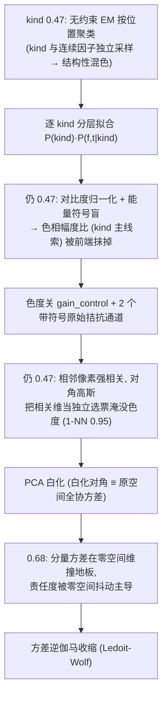
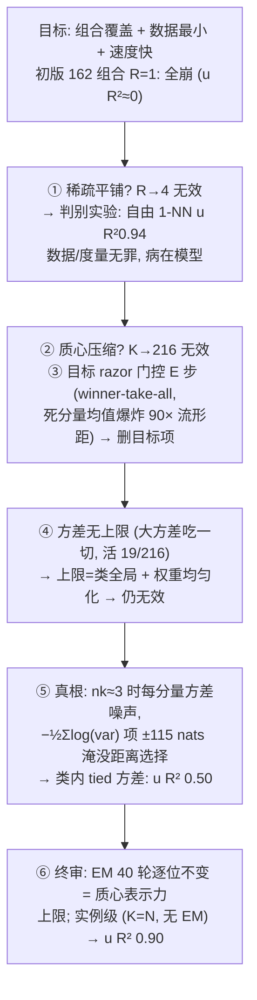
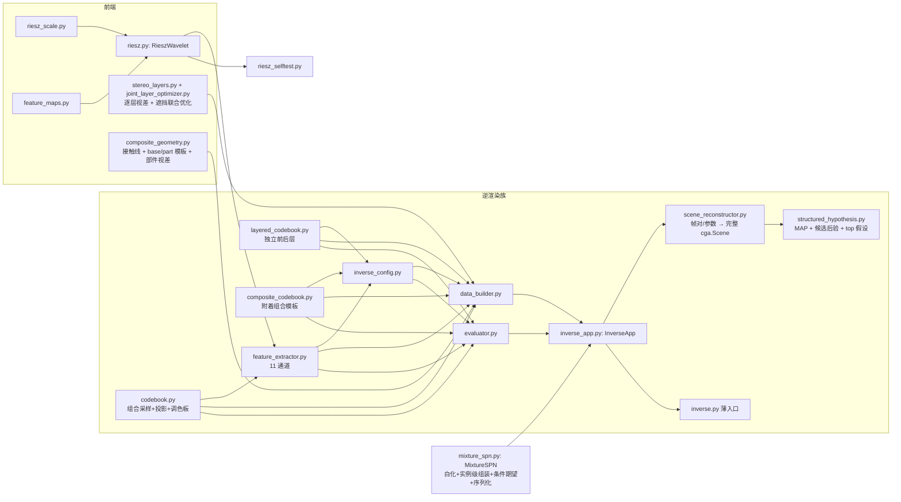
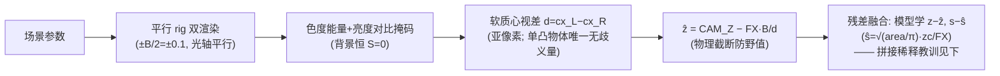

# conger 架构与流程图

SPN 逆渲染研究: 左右两张二维立体图像 → Riesz 全分辨率特征 → 完整
`cga.Scene` 重建 (含光照; `--n-objects 2` 启用双图元遮挡/前后层实验族)。
本文档是全部流程的总图 + 机制决策录; 各模块 docstring 有机制细节。

## 0. 主线切换 (2026-08-12/13)

两次退役: ① 离散场景码体系 (逐码贝叶斯/池化 SPN/码网格, 最后提交
7ae963f) —— 连续物理量的离散化只是后验求积; ② EM/质心压缩层
(提交 523b97a 的 MixtureSPN 初版) —— 小数据 + 弯曲流形下质心把点
平均到流形外, 实例级 (每样本一分量) 才是最小数据设计的正确形态。
git 历史保留全部旧实现。

现行唯一主线: 全因子覆盖连续采样 + 全分辨率实例级浅混合 SPN。

## 1. 主链路 (inverse.py)

```mermaid
flowchart LR
    subgraph DATA["数据 (DataBuilder)"]
        SAMPLE["全因子组合采样:<br/>kind3×图元色6×光色3×光向3=162 组合<br/>全笛卡尔 × R 连续复制 (最小数据)"]
        --> SCENE["Codebook.to_scene<br/>cga Scene"]
        SCENE --> RENDER["Renderer 渲染<br/>144×144 帧"]
        RENDER --> FEAT["FeatureExtractor<br/>11 通道全分辨率 (V=228K):<br/>L×3 Riesz (gain control)<br/>色度×3 Riesz (无 gc, 保色相幅度)<br/>色度×2 原始 (带符号拮抗)"]
    end
    FEAT --> W["PCA 白化 (Gram eigh, CPU)<br/>228K→D≤N−1 无损降维<br/>对角高斯≡原空间全协方差"]
    W --> ASM["实例级组装 (无 EM):<br/>逐 kind 分层, 分量=全部样本,<br/>类内 tied 方差, 均匀权重"]
    ASM --> PRED["predict: 责任度 (特征证据)<br/>E[u,v,s−ŝ,z−ẑ|x] ≡ 分层核回归<br/>P(kind,hue,lcol,ldir|x)=场景因子后验"]
    PRED --> REFINE["SceneReconstructor 渲染残差精炼:<br/>top-k kind × hue6×光色3×光向3<br/>左右图前景加权 RGB MSE"]
    REFINE --> POST["StructuredHypothesis:<br/>MAP Scene + 候选分数 + 联合后验<br/>+ top 完整场景假设"]
    POST --> EVAL["Evaluator: 物理单位 RMSE/R²<br/>+ kind/hue/lcol/ldir 分类准确率<br/>插值 vs 外推分裂"]
    POST --> RECON["完整预测参数 → to_scene → cga.Scene"]
```



实测 (结构-外观联合精炼版, N=1296, kind_topk=3): 插值 u,v RMSE
4.95/4.43px (R² 0.930/0.945) / s R² 0.508 / z R² 0.831 / kind 0.753 /
hue 1.000 / lcol 0.994 / ldir 0.895; 外推 u,v R² 0.949/0.953 / s,z
R² 0.922/0.956 / kind 0.617 / hue 0.981 / lcol 0.880 / ldir 0.772。
精炼前共享责任度的 lcol/ldir 仅 0.457/0.367; 候选重渲染把反照率×
光照歧义交回正向模型, 是外观辨识的主要来源。

结构似然消融 (均全 kind): 旧共享几何 kind 0.753 / s R² 0.332;
候选内直接切换逐 kind 几何 kind 0.704 / s R² 0.160 (面积掩码观测
偏差被放大); 责任度条件化几何 kind 0.698 / s R² 0.340; 现版共享几何
评分 + kind 后校准 s 达到 kind 0.753 / s R² 0.508。

## 2. 机制决策录 (全部实测驱动, 按时间序)

### 2.1 特征与分层 (2026-08-12)



### 2.2 EM 的四条退化通道 → 实例级 (2026-08-13, 全因子数据重设计时)

图元色与 kind 解耦 + 光照全因子覆盖后, 逐版本实测定位:



教训沉淀: EM/质心压缩是大数据优化; 小数据 + 弯曲流形时质心把点
平均到流形外。数据均匀采样 ⟹ 均匀权重是正确先验 (学权重反而
引入 log_w≈−20 死亡螺旋)。

### 2.3 特征图全集: 同一 p_s 的聚合, 分界线是能量 vs 形状 (2026-08-16, 修订)

`RieszWavelet.features()` 算全 11 张跨尺度图, `FEAT` 只取 3 张
(log_mag/phase_coh/ori_R) × 3 源 + 2 原始拮抗 = 11 通道。初版按
"结构轴 / 统计轴"两条正交轴二分, `src/texture_probe.py` (E1–E7) 实测
推翻: **11 张图全部是同一逐像素尺度能量分布 p_s=e_s/Σe 的聚合量 +
相位/方向一致量, β (功率谱指数) 扰动会同时泄漏进全部 11 张** (E5:
连 phase_coh/ori_R 也 1.00 分白/粉/蓝噪声), 两条轴并不正交。按对
p_s 聚合的阶数重排, 真正的分界线是**能量 vs 形状**:

- **能量 (0 阶矩)**: log_mag = log Σe_s, 随全局对比度 c² 平移
  (E7 对比度纯判别 1.00), 光照/曝光敏感。
- **形状 (高阶矩)**: slope/residual/bump/centroid/spread/skew/kurt 是
  p_s 的形状统计 (slope=1/f 衰减率, bump/centroid=主导尺度, 四阶矩=
  谱形指纹), 对 c 不变 (E7: 全部 0.00 对比度盲)。slope 是 β 的连续
  单调读数 (E5: 粉 0.73 < 白 1.25 < 蓝 1.28), 但带 +2/octave 量级
  滤波器组固有偏差 (等倍频程带通核能量随 f0 增长, 白噪声"平谱"被映成
  slope≈+1.25 而非 0)。
- **相位/方向一致量**: phase_coh / ori_R / mean_ori 是跨尺度比值, 对
  c 不变 (E7: 0.00)。

这 8 张对当前 u/v/s/z/kind/hue/lcol/ldir 是弱信息维, 根因仍是**场景
支持集无纹理自由度**: Codebook 材质固定 `MeshStandardMaterial(uniform
hue, roughness=0.55)`, 无 map/无材质变量 —— 渲染帧尺度谱退化为"轮廓
边缘 + 平滑明暗 + 恒暗背景", 8 张图方差几乎全由几何驱动, 与结构特征
+ 立体锚点冗余。cga 侧已加 `Texture`/`map`/`roughness` 标量 (cga
engine/texture.py, unlit/UV 已就绪), conger Codebook 尚未接线。

推论 (修正): 8 张统计图的判别价值**不是**对纹理的分类 —— 结构轴 3 张
在该类任务已 1.00 触顶 (E1/E2/E4/E5), 8 张不增可分性; 它们的价值是
① **slope 给 β 的连续可解释读数, 且对对比度/光照不变** (log_mag 既跟
β 又跟对比度, 二者混淆, E7), 材质/粗糙度回归应走 shape 轴而非能量轴;
② 全分辨率逐像素 + 全局白化**不会**打散结构化纹理 —— 纹理是低维全局
模式, PCA 白化把它收敛成主方向, 无需区域统计头 (`texture_pipeline.py`
实测: box 平面 3 类纹理 tex_id 准确率 1.00, sphere 粗糙度 R² 0.997,
全分辨率特征直接可估)。要让 8 张从"冗余维"变"头部特征", 仍须先给
Codebook 接线 map/roughness 并立监督目标 (roughness→t_mu, 纹理类型→
cat_logp), 特征只暴露数据里的方差, 顺序不可倒。

两个物理限制 (texture_probe.py E5 实测): ① 有限 Riesz 带
[1/lam_max, 1/lam_min] 截掉粉噪声低频 (被 DC 剥除) 与蓝噪声高频
(超出最细尺度), 蓝噪声 +β 几乎测不出 (实测 slope +1.28 vs 白 +1.25,
理论差 +0.69); 谱斜率判别需足够大图或更宽尺度带。② Wiener 收缩
(gain_control) 的噪声 floor 按每图最细尺度 MAD 估, 随 β 变 (蓝噪声
高 MAD→高 floor), 会把 β 泄漏进 log_mag/phase_coh 造成结构轴假可分;
做谱形判别须 gc=False 或统一 floor。

配套工程结论 (若全开 11 张图 → 33 Riesz + 2 原始 = 35 通道, V 3.18×):
① of_frame 现按 (src,ch) 逐条调 features() (每源重算 3 次、每次算全
11 张), 应改为按源循环每源一次; ② 白化 Gram O(N²V) 约 3.18×, basis
(V,D) 主导模型文件 (约 1.5GB → 4.8GB); ③ 弱信息维白化后仍占单位
方差, 会稀释责任度 (见 2.1 A4→F4 零空间抖动), 需逐通道标准化 +
sigma_rel_floor 重标定; ④ mean_ori 是环量 (−π/2, π/2] 有 0/π 跳变,
要加应加 resultant 笛卡尔分量 (m_re, m_im)/safe_total, 与 ori_R 构成
完整方向向量 (polar 拆开只给模长是信息浪费)。

探针复现: `python src/texture_probe.py` (E1 色度纹理 / E2 灰度纹理 /
E3 roughness / E4 棋盘尺度 / E5 谱斜率 / E6 对比度抖动 / E7 对比度纯判别);
`python src/texture_pipeline.py` (P1 纹理类型 / P2 粗糙度, 全分辨率端到端)。

主线接线 (已落地, `--n-textures N` 开关, 默认 0 不回归): Codebook 加
albedo map 纹理类型(离散, cat_logp)与 roughness(连续, t_mu), DataBuilder
targets/scene_classes 按 10 列解析, SceneReconstructor cat_sizes→
(3,6,3,3,N)。`python inverse.py --n-textures 3 --replicates 1` 实测:
几何/外观全变 + R=1 下 **tex 0.50/0.46 (chance 0.33) 仍可辨, 但
roughness R² −0.74/−0.71 (负, 劣于基线)** —— 修正 texture_pipeline.py
固定几何探针 (tex 1.00 / roughness 0.997) 的过度乐观: roughness 是弱
specular 瓣信号, 被几何/外观/纹理共同变化淹没, 且 R=1 无复制密度
(每组合单样本, 核回归退化为随机)。路径2/3 实测 (`texture_roughness_paths.py`,
held-out 几何): 全分辨率特征 sphere/box 均负 R² (−0.57/−0.28); **shape 轴
区域描述子 (8 谱形图前景 mean/std, 16d, gc=False) 在 sphere 达 R²
+0.916、box 仍 −0.08** —— 结论: roughness 须 (a) 限定空间 specular 瓣
可见的球面 kind + (b) 走 shape 轴专用头, 而非全分辨率逐像素; box 正面
均匀着色本无 roughness 信号。

**shape 头主线接线后仍负** (谱形头已落地 `RoughnessHead`, 球面限定):
`inverse.py --n-textures 3 --replicates 1` 球面 roughness R² 插值
−0.631 / 外推 −0.935。根因: `texture_roughness_paths.py` 的 +0.916 是在
纹理/外观 (hue/lcol/ldir/tex) **全固定**、只有几何+roughness 变时才成立;
主线里纹理(棋盘/条纹/噪声)、色相、光色、光向自由变化, 谱形描述子被这些
1 阶变化主导, roughness (specular 瓣) 是 2 阶弱信号被淹没, 且 R=1 无复制
密度。结论修正: **roughness 作为连续监督目标在自由外观/纹理的主线里不可
鲁棒估计** —— 它只对 specular 瓣有弱作用, 属 2 阶信号; 纹理类型(离散)可辨
(0.50>0.33), roughness 宜保持 0.55 常量或仅在外观/纹理受控的专用探针里
估计, 不作主线回归目标。已落地: `sample_textured` 固定 roughness=0.55,
`RoughnessHead`/`FeatureExtractor.shape_descriptor` 留作专用探针代码
(不接主线), 主线只监督纹理类型 (cat_logp)。

## 3. 渲染残差光照/结构精炼 (SceneReconstructor)

SPN 的共享责任度擅长几何与类别近邻, 但光照只贡献弱特征差异; 让
`hue/lcol/ldir` 三个边缘后验独立 argmax, 还会把反照率×光照的联合
歧义错误拆开。精炼级改为分析-合成: 默认覆盖全部 kind; 结构评分沿用
共享几何以避免候选间尺寸代理偏差, 候选返回前再按各自 kind 的面积→
尺寸代理重校准 s (sphere/cylinder 圆盘, box 正面), 并保留 SPN 学到的
s 残差。随后枚举 6×3×3 个外观候选, 用同一 cga renderer 重渲染左右
视图, 以前景加权 RGB MSE 得到候选分数:

```math
\ell(k,h,c,d)=\frac12\sum_{v\in\{L,R\}}
\frac{\sum_x m_v(x)\|I_v(x)-R_v(k,h,c,d)(x)\|^2}{\sum_x m_v(x)}
```

`--kind-topk 1|2` 只是低成本截断调试; 默认 `kind_topk=3` 覆盖当前
结构支持集。联合后验:

```math
p(k,h,c,d\mid I)\propto
p_{\mathrm{SPN}}(k\mid I)\exp(-\ell(k,h,c,d)/T),
\quad T=\max(2\ell_{\min},1)
```

`m_v` 与立体前景掩码同定义 (色度能量 + 背景亮度对比)。几何误差
对外观候选近似同置, 不改变排序; 结构候选则通过渲染残差与 SPN
结构先验共同裁决。公开接口返回 `StructuredHypothesis`: MAP Scene、SPN 原始
后验、候选残差/联合后验和 top 完整场景假设, 不再把歧义硬压成单点。

## 4. 遮挡/前后层实验族 (LayeredCodebook)

`--n-objects 2` 启用最小多层支持集: 两个不透明图元, 参数按深度规范
排序 (z0>z1, 0=前层/更靠近相机), 共享光色/光向; 离散因子为
kind0×kind1×hue0×hue1×lcol×ldir=2916 组合全笛卡尔积, 连续位置/尺寸/
深度逐样本随机, 约 70% 样本强制投影重叠。renderer 的最近命中自然产生
遮挡, 无需单独标签 —— 层序就是 z 序。

双层几何使用 `StereoLayers + JointLayerOptimizer`: 左图 9×9
RGB+色度+亮度梯度块匹配, 限制在物理视差范围 d∈[5,12], 以
second-best 比值剔除弱纹理像素, 先按 (x,y,disparity) 聚类得到初始
前后层; 随后在低分辨率上联合优化两层的圆/方模板、中心、尺度、视差
中心和像素分配。候选可见区为 T_front 与 T_back\T_front, 得分同时
惩罚前景掩码不一致、视差不一致和后层过度遮挡。实测模板面积在错误
聚类下会膨胀, 因此最终分工是: 联合优化给中心/深度, 面积仍由可见区
+ ContourCompleter soft fusion 提供。渲染残差精炼仍未启用 (2916
结构×外观候选需先验证逐层几何)。

首版实测 (R=1, N=2916, sv3/sl8): 插值 kind0/kind1 0.398/0.357,
hue0/hue1 0.421/0.171, lcol/ldir 0.390/0.370; u0/v0/u1/v1 R²
0.537/0.711/0.466/0.432。调试中修正了前层定义错误 (相机在 z=5.5,
z 大者近), 加入残差限幅、轮廓 soft fusion 和遮挡联合模板优化;
最终分工是联合模板给中心/深度, 可见区+补全给面积, 前层全残差,
后层 u/v 残差 + s/z 锚点。

### 4.1 显式组合模板 (CompositeCodebook)

组合模板学习的第一阶段不是开放式“发明几何”, 而是把已有 primitive 的
稳定组合声明为新的结构专家。`CompositeCodebook` 与 `LayeredCodebook`
使用相同的 14 维参数契约 (两个 kind/hue + 共享光照), 但生成机制不同:

- **layered**: 两个物体的位置/尺度/深度独立采样, z 序决定遮挡;
- **composite**: 0 号图元是底座, 1 号图元由底座导出 —— 尺度比例
  0.35–0.75, 顶部接触带少量嵌入, 横向偏移有限, 深度只有轻微抖动。

Composite 几何使用 `CompositeGeometry`: 在低分辨率前景掩码上搜索
attached_on_top 接触线, 将上部 part 与下部 base 分别拟合圆/方模板,
再在右图模板窗口内估计各部件视差; 输出 `[u,v,z,area]×2`。训练目标
是 8 个几何量相对这些锚点的有界残差, 而不是让 SPN 从全局特征直接
恢复每个部件。`--refine-composite` 可在推理时固定该几何, 对 top-k
k0/k1/h0/h1/lcol/ldir 候选做左右图渲染残差精炼; 默认关闭, 因为
全量 2916 组合测试的候选渲染成本仍高。

全局锚点基线 (cp1, R=1, N=2916): 插值 u0/v0/u1/v1 R²
0.907/0.516/0.891/0.794, s0/z0 R² -0.528/-0.692。部分感知锚点
(cp2, 同规模, 无精炼) 提升到 u0/v0/u1/v1 R²
0.982/0.972/0.990/0.970, s0/z0 0.089/0.823, s1/z1 -0.474/0.875;
外推 u/v 全部 ≥0.978, s/z 为 0.732/0.921/0.429/0.949。小样本
锚点自检 (24 帧): 中心 RMSE u0/v0/u1/v1 = 3.63/0.85/3.46/2.73px,
部件 s RMSE 0.038/0.034。类别指标仍约 kind0/kind1 0.511/0.355,
hue0/hue1 0.504/0.365; 几何瓶颈已明显缓解, 剩余瓶颈是 part 外观与
结构辨识。

## 5. 模块结构 (一文件一类)



依赖方向单向; codebook/feature_extractor 仅 TYPE_CHECKING 引
InverseConfig 防环。

## 6. 持久化 (safetensors)

- 数据缓存: `artifacts/mix_*.safetensors` (配置指纹文件名, gitignore);
- 模型: MixtureSPN.save/load —— 参数张量 (含白化基 basis (V,D),
  全量约 1.5GB) + rel_floor/cat_sizes/n_stratum 入 JSON 明文头;
  Utils.st_metadata 可查;
- 结构注册表: `artifacts/registry_manifest.json` 保存动态子模板
  ChildTemplateSpec、parent/delta 约束、pending specs 和模型路径;
  重启后由 `ChildCodebookFactory` 重新物化 Codebook, 再加载对应
  safetensors;
- 默认模型路径 `spn_kindgeo_<数据指纹>`、`spn_layered_anchor_<数据指纹>`
  或 `spn_composite_<数据指纹>`
  (`kindgeo` 标记 kind-conditioned s 残差, `anchor` 标记双层逐层锚点契约,
  `composite` 标记附着组合模板)。

## 7. 待办 (按价值排序; 已对照实例级架构审判, 过时项已删)

1. **组合模板联合门控** (已接入): single/layered/composite 三专家
   联合基准在两个随机种子各 9/9; 下一步扩大到更多连续场景并统计置信校准
2. **模板复杂度门控** (已接入): 结构专家携带参数/描述复杂度,
   门控分数加入惩罚, 防止更复杂组合模板仅靠自由度占优
3. **残差驱动模板提案** (已接入): 未知结构残差 → 有限组合候选
   → StructureBirthRequest; 下一步把候选空间升级为有界文法
4. **有界模板文法** (已接入): attach/layer/repeat/mirror, 限制深度、
   部件数与候选网格; 下一步用真实出生样本统计提案命中率
5. **双层渲染残差**: 联合模板已稳定中心先验, 下一步在 StructuredHypothesis
   候选中启用分层渲染残差, 重点验证后层 s/z 与遮挡边界
6. **池外光照探针**: held-out 光向/光色, 验证完整 Scene 输出的光照
   泛化与反照率×光照联合可识别性
7. **逐 kind PPCA 似然比**: kind 形状线索的度量升级 (各类自己的
   白化子空间 + log|det| 修正, 跨类密度可比化)
8. **大数据逃生通道** (N~10⁴ 触发): PCA 基按内在维度截断 /
   子样本估基全量套用 / ANN 索引加速推理 / 压缩蒸馏 —— EM 若
   回归只能作实例模型的对照验证压缩件 (退化通道病历见 §2.2)

### 7.1 场景级几何-光照 ECM 精炼 (已实现, 验收未通过)

**状态**: 已按通用 EM 框架 (`generic_em.EMLoop` + `scene_em_refiner.
SceneEMRefiner`) 实现, 接入单物体推理/评估链路 (默认关闭, `--em-refine`
开); 全量 N=1296 验收未通过 —— u/v 提升但 s 崩溃, 见下。

**数学形式** (不变): 场景拆成几何 \(G=(u,v,s,z)\) 与外观 \(A=(hue,lcol,
ldir)\)。E 步固定 G 枚举 54 外观候选渲染残差成后验 \(q(A|G)\); M 步固定
q 对 u/v/s/z 坐标搜索最小化期望残差 \(\sum_j q(A_j)\ell(I,R(G,A_j))\)。
kind 固定 (来自 SPN MAP), 只精炼连续几何, 不参与极大化。

**实现边界** (已落地): 不改 Codebook/DataBuilder/MixtureSPN.fit/add;
`StructuredHypothesis` 加 `em_trajectory`; `InverseConfig` 加 `em_refine/
em_max_iters/em_appearance_topk/em_tolerance`; 推理 (`from_frames`) 与评估
(`refine_scenes`) 共用 `SceneReconstructor.em_refine` helper。

**全量验收 (N=1296, 单物体, kind_topk=3, em_max_iters=2)**:
u/v R² 提升 (插值 0.930→0.963 / 0.945→0.971, 外推 0.949→0.977 /
0.953→0.978, RMSE ~4.9→3.6px); 但 **s R² 崩溃** (插值 0.508→-0.376,
外推 0.922→0.750), z 略降 (插值 0.831→0.769), 触发 self_check 断言。
离散因子 (kind/hue/lcol/ldir) 全部不变, 符合「只动几何」设计。根因:
s/z 有投影歧义 (大而远 ≡ 小而近), 贪心坐标搜索把 s 拖坏。

**成本**: 单样本推理 2.22s→4.58s (2.06×); 全量 run 基线 ~40min →
ECM ~80min。

**未过验收的下一步** (按价值): ① s 不参与坐标搜索 (只精炼 u/v, 最小
改动, 最可能快速过验收); ② s/z 联合搜索 (而非独立 ±δ); ③ 缩小 s 步长
或加约束。默认保持关闭, 待单物体指标不降后再开; 双层仍未接 (逐层几何
稳定后再说)。

**与旧结论的关系** (不变): §2.2 否定的是小数据弯曲流形上的 EM 质心
压缩; 这里是已知 renderer 下的场景级后验推理, 问题层不同, 不构成回退。

### 7.1.1 通用 EM 框架与验证实例

§7.1 的 ECM 是「通用 EM 框架」的一个实例。框架 (`src/generic_em.py`)
把生成模型抽象为「观测 ← (隐变量 Z, 参数 θ)」, `EMLoop` 只管 E 步(软后
验)/M 步(极大化)/对数似然收敛监控, 带 temperature(锐化)与 damping(稳定)
旋钮。已验证 8 个实例, 覆盖 EM/坐标上升的各种形态:

| 实例 | 隐变量 | 参数 | M 步 |
|---|---|---|---|
| 透明层叠加 | 像素软归属 | 层强度 | 加权平均(闭式) |
| 遮挡↔深度序 | 深度序(二元) | 两层线性系数 | 加权线性拟合 |
| 反照率↔光照(Retinex) | 反照率(中间量) | 光照线性系数 | 线性拟合(坐标上升) |
| 深度↔法向 | 法向(调和) | 深度场 | Tikhonov 线性解 |
| 分割↔位姿 | 前景归属 | 位姿+两强度 | 位姿坐标搜索 |
| 运动分割↔光流 | 运动层归属 | 各层速度 | 加权速度(+空间平滑) |
| 对应↔几何(EM-ICP) | 点软对应 | 刚体变换 | Kabsch/SVD |
| 几何↔光照(ECM) | 外观候选 | 几何 u,v,s,z | 坐标搜索(黑盒渲染) |

每个实例是自包含模块 (`src/*.py`) + 黑盒测试, 与主链路解耦 (不影响
MixtureSPN 训练/推理耗时)。踩坑记录: 混合类 EM 从对称初始化会塌到
「所有分量=均值」的不动点 (需非对称 init); figure-ground 硬空间先验会
卡死掩码、无先验会塌缩 f=b, 需软先验 + 位姿坐标搜索。

### 7.2 动态类别与动态场景结构 (当前实现)

目标是把增量学习从“同分布样本追加”扩展到“世界支持集增长”。分两层
处理, 不把所有变化塞进一个固定结构模型。当前已实现机制层:
类别契约序列化与 padding 扩展、StructuredHypothesis 新颖性证据、结构专家
注册/加载 (`ExpertRegistry`)、渲染残差门控、未知结构出生队列
(`StructureBirthController`); 出生请求只聚合证据并要求可渲染结构族,
不自动发明 renderer 不支持的新几何模板。

**类别动态学习** (参数维度不变, 类别数变化):
`MixtureSPN` 需显式序列化 `cat_sizes`/因子名/结构版本; 新类别出现时
旧 `cat_logp` 按因子 padding (新类别概率 0), 新分量再携带新类别。
新颖性证据由最大责任度、特征似然、渲染残差和离散后验熵组成; 只有
多证据持续不兼容时才创建新类别, 避免噪声幻觉。

**结构动态学习** (参数维度/层数/遮挡关系变化):
采用结构专家混合, 不原地改写旧专家:

```math
p(S,M\mid I)\propto p(I\mid S,M)p(S\mid M)p(M)
```

每个专家有自己的 Codebook、MixtureSPN、Reconstructor; 结构门控
`p(M|I)` 来自最佳渲染残差、结构先验、模板复杂度和观测级几何证据:

```math
\mathrm{score}_M=\ell_M+\lambda C_M+\eta G_M(I),\qquad
p(M\mid I)\propto p(M)\exp(-\mathrm{score}_M/T)
```

`C_M` 是模板描述复杂度 (single=1.0, composite=1.5, layered=2.0);
`G_M(I)` 由 `StructureGeometry` 给出: 单模板紧致性、前后层视差/空间
分离、attached_on_top 接触线和部件深度一致性。纯渲染残差在 3 族小样本
基准只有 4/9, 因为复杂专家可用错误结构凑出更低像素误差; 加入几何证据
后两个随机种子各 9/9 (合计 18/18)。出生判断仍看原始
\(\ell_M\), 防止复杂度/几何惩罚把真实未知结构误解释为“简单专家更合适”。
所有专家都不兼容时才触发结构出生候选。新结构必须有可渲染模板; 模型可以发现“现有
结构不对”, 但不能凭空发明 renderer 不支持的几何。

**模板血缘** (当前实现): `TemplateLineage` 记录
`family/parent_family/operation/delta/generation/complexity`。当前树为
`single → layered → composite`; `ExpertRegistry.lineages()` 暴露血缘表,
`children_of(parent)` 查询直接子模板。`StructureCase` 记录触发出生时的
winning structure, `TemplateProposal` 携带 `parent_family` 与具体 delta。
这使“子模板”成为可序列化、可聚类、可审计的对象, 为后续从多个相似
提案自动估计约束范围提供契约。

**数据驱动子模板** (第一阶段当前实现): `TemplateDeltaLearner` 聚合多个
出生请求的 `TemplateProposal`, 按 `parent_family+operation` 分组并估计
数值约束范围 (ratio/lateral/depth) 与离散支持集 (part kind/hue);
`ChildCodebookFactory` 支持把 attach/layer/mirror/repeat spec 物化为受限
Codebook 子类; attach 使用上下接触几何, layer 使用 StereoLayers,
mirror/repeat 使用 `LateralCompositeGeometry` 的垂直分隔与部件视差。
`ExpertRegistry.enable_child_template_learning()` 会把后续出生请求自动
学习为 `pending_child_specs`; 只有显式 `confirm_child_template(name)`
才物化、训练并注册。该阶段不会自动训练, 也不会把单次异常提案提升为模板。

真实样本闭环 (`child_template_benchmark.py`): 两个受约束 attach 渲染样本
先由提案器产生候选, learner 得到 `composite → composite_attach_5025cfd1`
(scale_ratio 0.43–0.62, lateral_ratio -0.02–0.02, part kind/hue 固定),
动态子 Codebook 覆盖 162 组合并以 R=4/648 样本训练。3 个同分布
held-out 样本上, 子模板对父 composite 门控 3/3 (posterior
0.815/0.699/0.599)。该验收证明“提案→约束→子模板→注册→门控”闭环,
但仍是受控合成漂移, 不等于开放世界自动模板发明。

多操作真实闭环: `child_operation_benchmark.py` 对 layer/mirror/repeat 均
执行真实渲染提案 → spec 学习 → 动态 Codebook → 显式训练 → 父子门控。
mirror/repeat (R=8) held-out 均 3/3; layer 子模板使用受限全残差解码
(R=4) 后 2/3, 后层 s/z 仍受双层几何瓶颈限制。加入 lateral 几何证据后,
原 single/layered/composite 联合门控两个种子仍保持 18/18, 且 lateral
样本不会被误判为 layered。

多子模板混合门控 (`mixed_template_benchmark.py`): 从 4 个 manifest 恢复
attach/layer/mirror/repeat 子模板并与 3 个父模板共同门控。结构门控已
从平铺 softmax 改为两级「父族 → 族内父子」后验
(`GenericStructureGate.decide_hierarchical`): 先按 `geometry_family`
(single/layered/composite/lateral) 做父族 softmax, 再在族内做父子
softmax, 联合后验 = p(family)×p(expert|family), 两级各自按本级最低分
标定温度, 避免平铺混合在父子模板并存时的过置信; `temperature_scale`
与 ECE 提供校准旋钮/报告。mirror/repeat 的操作判别
(`StructureGeometry.lateral_gap_cost`) 修正了旧版面积→半径的 √π
归一化偏差 (sum 分母不抵消), 改取像素空间归一化间隔并加交叉判别
惩罚。附带修复 `LayeredReconstructor` 遮挡锚点残差到负下限时 s 塌成
负值导致的 `cylinder radius <= 0` 崩溃 (物理下限钳制)。

repeat→mirror 的根因与修复 (kind 轮廓拟合子项目): 圆柱 `length=2.2s`
沿视轴 (+Z), 可见端盖在 `z+1.1s` 处, 表观半径按 `zc/(zc−1.1s)` 放大;
叠加离轴侧表面、max-pool 下采样对小部件额外膨胀、前景阈值偏移, 观测
归一化间隔 `g_obs` 相对真值系统性偏小 1.09–1.52×。子项目落两处:
① `LateralCompositeGeometry.estimate` 改为模板足迹内全分辨率圆拟合
(`_disk_fit`, 消 max-pool 膨胀) + 逐 part 视差深度; ②
`LateralCompositeGeometry.corrected_gap` 按 kind 近端盖偏移 (sphere
0 / cylinder 1.1 / box 1.0) 反解真实世界 s/x, 重算 g。
`StructureGeometry.lateral_gap_cost` 改用 `corrected_gap` (直接取自
原始帧, 与重建锚点解耦, 不改已训练模型契约), 并修复 `range_term`
带外仍给窄带特异性奖励的 bug。判别对 4 个 lateral held-out 全部正确。
又发现 repeat→composite 的家族级混淆根因是 `CompositeGeometry` 对左右
并排样本退化出伪水平接触线 (把横向间隔误判成 attach 的零横向偏移),
在 `StructureGeometry.costs` 加横向证据强于 attach 时拒绝 composite。
attach 子模板的族内父子判别改由 `CompositeGeometry.disk_evidence` 提供
全分辨率圆拟合的 ratio/lateral (覆盖 bbox 的 max-pool 膨胀), 使窄带
attach 子模板在匹配时吃到正确负证据。最终 N=14 为 12/14: mirror/repeat
4/4, 剩余 attach 1/2 (小模型残差 2073 主导)、layer 1/2 (横向偏移强制
加宽后后层可见, 旧模型未重训仍 1 例误判)。剩余错误均为 R=4 小模型
残差问题, 需重训 attach/layer 子模板。

layer child→single 根因 (数据 bug, 非门控): 学习到的 layer 子模板
`lateral_ratio [-0.02, 0.02]` + `scale_ratio [0.43, 0.62]` 使后层投影
半径/横向偏移都远小于前层 (a1/a0≈0.26–0.47, |offset|≤0.02·(a0+a1)),
后层投影完全落在前层投影内被完全遮挡 → 每个 layer child 样本渲染出来
就是单物体, `StereoLayers` 分不出不可见后层 (退化 fallback)。修复在
`ChildCodebookFactory._layer`: 近对齐横向偏移被强制加宽到 (0.35, 0.7),
保证后层投影越出前层。注意现有 layer child 模型 (R=4) 是用旧窄范围
训练的, 需重训才生效; 彻底解决还需重训 layer child。

**实施顺序**:
1. 类别契约序列化 + padding 扩展;
2. StructuredHypothesis 新颖性证据;
3. 结构专家渲染残差门控;
4. 未知结构出生检测与候选训练注册 (`StructureBirthRequest` →
   `train_and_register`)。
非参数贝叶斯/DP 暂不进入主线 —— 当前实例记忆下, 阈值式类别出生
更简单且可测试。

**残差驱动模板提案** (当前实现): `StructureBirthController` 可挂载
`TemplateProposer`; 达到 `min_cases` 后, `StructureBirthRequest` 除原始
证据外还携带 `TemplateProposal` 列表。视觉侧的
`CompositeTemplateProposer` 以最佳估计的 0 号图元为底座, 由
`TemplateGrammar` 枚举 depth≤2 的 attach/layer/mirror/repeat 规则,
再枚举有限的尺度比例、横向偏移和 hue, 用同一 renderer 的左右图前景
加权残差排序。提案只是候选描述, 不自动训练、不自动注册; 这样既保留
结构出生的主动性, 又保留 renderer/训练数据边界。

**通用化验证**: `StructuredHypothesis` / `ForwardModel` /
`GenericStructureGate` / `GenericExpertRegistry` 已把上述机制从视觉
命名中剥离; `ToySeriesFamily`/`ToySeriesExpert` 提供线性/振荡两个
非视觉结构专家, 测试验证正确机制门控和二次机制出生请求。视觉路径
已迁回通用接口: 视觉路径直接返回 `StructuredHypothesis`, `scene` 字段
承载 `cga.Scene`; 视觉 `StructureGate` 继承 `GenericStructureGate`,
只保留图像残差适配。

已删过时项 (2026-08-13 审判): DP-SVI 自动定 K (实例模型 K=N, 无
分量数可定) / online EM (无 EM 可 online, 需求并入逃生通道) /
熟悉尺寸先验重接 + 局部线性核回归 (单目 s/z 歧义的解法, 单目
模式已删, 立体下 s/z 由几何解决) / 参考物破解色恒常 (随遮挡
模式一起删)。

## 8. 双眼视差 (stereo.py, 2026-08-13)



实测 (全量): 视差管线 ẑ RMSE 0.35 (bias +0.30 = 可见面≠中心的系统
偏差, 残差学习标定); 融合后 z R² 0.85 / s R² 0.41
/ **外推 z R² 0.96** (几何量不饱和, 核回归边界问题在 z/s
上消解)。

踩坑记录 (全部实测): ① 角部样本 (大 s×近 z) 边距反演出画 → 空掩码
1/d 爆炸 → 采样器加取景约束拒绝采样; ② 裸 area (σ≈600) 拼特征
主导 λ 谱 → 白化截断阈值抬升误截特征方向 → 拼接维先缩放到特征
方差量级; ③ 强几何观测直接拼特征被白化稀释 (1/647 维) → 残差
参数化融合。

**增量训练** (2026-08-13): 采样逐复制块独立种子 (SAMPLE_V=3) → R
增长纯追加; 数据逐块缓存 (缺哪块渲哪块); 模型 `MixtureSPN.add`
= 冻结白化基追加分量 + tied 方差全量重估 (实例级 f_mu 即样本,
与全量 fit 同估计量)。唯一近似 = 基冻结: 新样本跑出旧主子空间
的方向不可表示, 分布漂移大时重新 fit。

## 9. 因果性定位与三条路线 (2026-08-14)

### 9.1 定位: 已知 SCM 反演 + 相关性密度内插的混合体

「当前架构能否学到因果关系」分三层作答 (层不同, 结论不同):

| 层 | 组件 | 因果地位 |
|---|---|---|
| 正向模型 | `Codebook.to_scene` → cga renderer | **已知** SCM (投影/材质/光照机制), 不是学来的 |
| 密度估计 | `MixtureSPN` (白化 + 实例级混合) | 联合密度 P(feature,params), **无因果方向** (纯相关) |
| 反演/精炼 | 分析-合成 (§3) + 结构门控 (§7.2) | **do-干预查询** (枚举候选重渲染 = do(x) 后观测真机制) |

关键推论:

- 系统已拥有完整 SCM (renderer), 无需从数据学因果方向 —— 全因子采样
  `kind×hue×lcol×ldir` 是**给已知因果图收集干预数据** (斩断混杂), 不是
  因果发现。采样器知道因果图, SPN 只在图上做密度估计。
- s/z 投影歧义 (大而远 ≡ 小而近) 是**因果不可识别** (两个原因单目等价):
  §7.1 ECM 的 s 崩溃 (0.508→−0.376) 是纯生成拟合在不可识别处的必然
  失败, 不是 bug; 解药是双目视差锚点 (§8) = 工具变量/额外观测, 全部
  来自多视几何, 无一处来自 SPN 学习。
- 真正「接近因果」的两处: `TemplateDeltaLearner` 学机制 (操作→参数变化,
  操作是干预变量); 结构门控 `score_M=ℓ+λC+ηG` 是反事实比较。

### 9.2 三条路线的对象、关系与选型 (无根本冲突, 两处张力)

| 路线 | 作用对象 | 图前提 | 层 |
|---|---|---|---|
| ① 因果不变性正则 | 渲染因子图 (hue/lcol/ldir→渲染) | 图已知 | 精炼/损失层 |
| ② 显式 SCM 机制代理 | 同上渲染因子图 | 图已知 | 估计器层 (对照件) |
| ③ 结构级因果发现 | 模板操作图 (操作→delta) | 图未知 | 结构动态层 |

- **张力 1 (包含)**: ② 蕴含 ① —— 显式 SCM 的模块性自动给出不变性,
  ① 是 ② 的弱化版。依赖方向: ① 是 ② 的**验收判据** (每个机制代理
  都要过不变性检验), 不是并列项。
- **张力 2 (黑盒 renderer)**: ② 不直接参数化真 renderer, 而是另建可
  微/可快速 do 查询的机制代理; 代理的因果有效性靠拟合干预数据保证,
  检验标准恰是 ①。
- **张力 3 (回归)**: ② 与 §3 分析-合成 + SPN 外观后验同目标 (hue/
  lcol/ldir 已 1.000/0.994/0.895)。② 只作**对照/校准件**, 不替换。

pipeline 关系: ② (机制代理) → ① (不变性判据) → ③ (结构边验证)。

### 9.3 落地 (按顺序)

**路线 ① `src/causal_invariance.py`**: 池外光照探针 `LightingHoldout`
(lcol/ldir 分类 holdout) + `marginal_appearance` (把联合外观后验对
光照边际化, 反照率估计对光照不变) + `invariance_score` (跨光照分组
最差准确率) + `InvarianceProbe` (分析-合成在 held-out 光照下反照率
估计不变性的端到端测量)。分析-合成靠 re-render 全光照候选, 其反照率
估计**按构造**对 held-out 光照不变 (do-搜索, 非学习密度); SPN 相关
密度则退化 —— 探针测量这个差距。

**路线 ① 接入主链路 (不变估计器, 结论: 保持默认关)**: `SceneReconstructor.
marginal_joint` + `decoupled_map` (解耦 MAP), 经 `InverseConfig.
appearance_marginalize` + `--appearance-marginalize` 开关控制 (默认关, 走
联合 argmax)。全量 N=1296 验收的**关键教训**:

- 四因子全拆边缘化 (kind/hue/lcol/ldir 各自 argmax) → lcol 0.994→0.870 /
  ldir 0.895→0.731 (幽灵光照组合); 修正为光照联合 argmax 后 ldir 恢复到
  0.827, 但 **lcol 仍 0.873**。
- 更深结论: 反照率 (hue) 对边缘化鲁棒 (1.000→0.994, 几乎不变), 但**光照
  (lcol/ldir) 不鲁棒** —— 联合 argmax 的精度来自 renderer 对反照率×光照的
  **联合**消歧, 任何边缘化 (即使因果正确的 hue↔光照分离) 都丢弃这份消歧
  信息。因果不变性是**不对称**的: 「反照率对光照不变」成立, 但不意味着
  「光照对反照率边缘化也免费」。
- 因此 `appearance_marginalize` **保持默认关**: 支持集内它不带来收益且
  掉 lcol/ldir; 其唯一潜在价值在 held-out 光照 (SPN 先验退化) 的鲁棒性,
  端到端尚未验证。路线 ① 的「不变性正则」作为探针 (§9.3 首段) 已达标,
  作为估计器接入主链路则被这条不对称性否定。

**路线 ② `src/scm_proxy.py`**: `AppearanceMechanism` 把黑盒 renderer
的外观子图分解为乘法机制 `P(I_color|hue,lcol,ldir) ≈ albedo[hue] ⊙
lighting[lcol,ldir]` (MeshStandardMaterial 反照率×光照物理), 从干预数据
ALS 估计两机制项; 提供 `predict`/`do_lighting` (反事实) + `albedo_
invariance` (秩一重构误差 = 模块性/不变性分数)。只作快速 do 查询与
校准件。

**路线 ③ `src/causal_edge.py`**: `CausalDeltaLearner` 把 `TemplateDeltaLearner`
的 delta 边升级为候选因果边 `CausalEdge`: 提案按环境 (seed/父几何配置)
分组, 每组估约束范围, 跨组一致度 = 因果证据 (不变性因果发现/ICP 精神)。
`agreement` 高 → 边是稳定机制; 低 → 伪相关。

**路线 ③ 接入真实提案闭环**: `CompositeTemplateProposer._observed_delta`
从观测帧提取实测 delta (attach/layer 用全分辨率圆拟合 `disk_evidence`,
mirror/repeat 用 `corrected_gap` 反解 period), 挂到提案
`metadata["observed"]`; `CausalDeltaLearner` 优先读实测 delta (而非网格
搜索点), 默认环境键回退 `case_index`。这使因果边验证吃的是**数据实测**
而非语法网格 —— 网格值恒定会让一致度虚高, 实测才有判别力。

**实测 (合成/单场景校准, 非全量验收)**:

- 路线 ①: `causal_invariance_probe.py` 在 4 场景 (2 池内 + 2 池外光照)
  上 hue 不变性 1.000 / gap 0.000 —— 分析-合成按构造对 held-out 光照
  不变, 印证 §9.1 的 do-搜索论。
- 路线 ②: `scm_proxy_benchmark.py` 固定几何渲染 54 干预样本, 乘法机制
  重构误差 0.020 / 反照率不变性 0.980; 反照率项恢复 6 个真实图元色
  (hue0 红 / hue2 绿 / hue4 蓝…), 光照项恢复白/红/蓝增益方向
  (白 [1.03,1.12,1.03], 红 R↑, 蓝 B↑)。残余 0.02 来自环境光/着色对
  纯乘法模型的轻微偏离。
- 路线 ③: `CausalDeltaLearner` 黑盒测试验证「跨 3 环境稳定的 scale_ratio
  → agreement 1.0 (因果)」vs「跨环境漂移的 lateral_ratio → agreement 0.0
  (伪相关)」; 单环境 (n_envs=1) 不可判因果。
- 路线 ① 接入: `decoupled_map` 黑盒测试验证尖锐后验下解耦 MAP ≡ 联合
  argmax (单元级成立), 及光照联合 argmax 不选幽灵组合; 但**全量验收显示
  真实后验对光照不尖锐, 边缘化仍掉 lcol/ldir** (见上), 故保持默认关。
- 路线 ③ 接入 (`causal_edge_benchmark.py`, 环境=光照, 每环境多样本):
  attach→scale_ratio 机制真实时 agreement 0.90 (因果), `--drift` 让 ratio
  逐环境漂移时 agreement 0.27 (伪相关) —— 实测 delta 成功区分稳定机制
  与漂移相关。lateral_ratio 在两种设置都稳定 (drift 只动 ratio)。

## 10. 模型内存与动态遗忘 (`src/model_memory.py`, 2026-08-17)

§7.8「大数据逃生通道」的落地探针: 按需加载 (内存↔硬盘) 与动态遗忘
(基内在维截断 / 分量驱逐) 的量化权衡。

### 10.1 内存画像 (实测)

单物体 N=1296 模型 459.6MB: 白化基 `basis` (V=228098 × D=497) 占
453.5MB = **98.7%**; 分量表 (f_mu/f_var/t_mu/cat_logp/log_w) 合计
~6MB。全专家注册表 (single/layered/composite + 6 子模板) **~6.3GB**。
mlx `mx.load` 的 safetensors 是 mmap 惰性 (加载 459MB 仅 ~60ms, 真正
成本在首次 compute 的物化, RSS ~545MB)。推理 SPN-only 42.6ms/frame
(精炼 54×2 渲染才是 2.2s/sample 的大头)。

### 10.2 按需加载 (split 序列化 + 分级加载)

白化变换 (f_mean+basis) 只在 `_z` 白化时需要; 分量表是门控评分/类别
契约检查的常驻部分。`split_save` 分文件 → `load_components` 只载 ~5.3MB
(供门控/契约检查, 不触 basis), `load_transform` 载 454MB 基, `assemble`
全量装配。价值: 多专家注册表可只常驻各专家的分量表, 白化基按需物化。

### 10.3 动态遗忘: 基内在维截断是主要杠杆 (反直觉但稳健)

| D | 模型大小 | kind | hue | lcol | ldir | u RMSE | 推理 |
|---|---|---|---|---|---|---|---|
| 497 (全) | 459.6MB | 0.562 | 0.623 | 0.463 | 0.395 | 5.26px | 10.9ms/f |
| 128 | 119.1MB | 0.623 | 0.605 | 0.457 | 0.333 | 3.46px | 0.6ms/f |
| 64 | 60.1MB | 0.617 | 0.685 | 0.488 | 0.370 | 3.49px | 0.7ms/f |
| 32 | 30.5MB | 0.593 | 0.790 | 0.519 | 0.370 | 3.64px | 0.7ms/f |
| 16 | 15.8MB | 0.642 | 0.642 | 0.537 | 0.407 | 4.09px | — |

(SPN-only, 插值 ti0 162 帧; 全量精炼后绝对值更高, 趋势不变)

**结论**: 白化基 D=497 是过完备的 —— 内在维 ~16–64。截断到 D=32 时
模型 **15× 更小**、推理 **15× 更快**、且 kind/hue/lcol **精度反升**
(kind 0.562→0.593, hue 0.623→0.790)。根因即 §2.1 的「零空间抖动」:
白化按 1/√λ 放大了低方差尾维, 这些维对类别/回归是噪声, 稀释了责任度;
截掉尾维 = 去掉被放大的噪声。这正是 §7.8「PCA 基按内在维度截断」的
实测验证。D 再降到 16 时 u RMSE 回升 (4.09px), 说明截太狠开始丢几何
信号 —— 甜点约 D∈[32,64]。

### 10.4 分量驱逐 (coreset) 在当前规模有害 (印证 §2.2)

| K | kind | hue | u RMSE |
|---|---|---|---|
| 1296 | 0.781 | 0.641 | 4.05px |
| 648 | 0.703 | 0.500 | 4.15px |
| 324 | 0.578 | 0.422 | 6.45px |
| 162 | 0.547 | 0.359 | 9.90px |

N=1296 时驱逐分量 (即使 greedy 最远点 coreset) 立刻掉精度 —— 实例级
密度在这个规模仍是必要的 (与 §2.2 的「小数据弯曲流形实例级最优」一致)。
分量驱逐是**速度/上界**杠杆 (O(K·D)), 但当前 K=1296 的推理已快, 驱逐
只在 N~10⁴+ 时才有净收益; 且 D 截断已把 K·D 从 644K 砍到 ~41K, 分量
驱逐的边际收益被 D 截断覆盖。**实施顺序: 先 D 截断, 分量驱逐留待 N 上量级。**

### 10.5 落地边界

`model_memory.py` 提供 `split_save/load_transform/load_components/assemble`
+ `truncate_basis` + `forget_components(policy=coreset|random)` +
`model_size_mb`; `model_memory_benchmark.py` 扫描量化。**未接入主链路**
(默认仍全量加载、D=497 全维): 因为 D 截断改变了推理度量, 全量验收
(精炼后 kind/hue/lcol/ldir) 需重标定自检阈值后才能默认开启 —— 下一步
把 `truncate_basis(D≈48)` 作为默认并跑全量 N=1296 验收。
