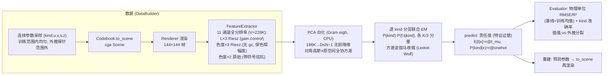
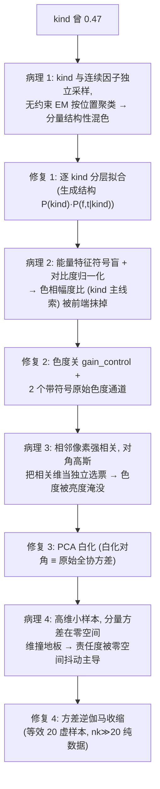
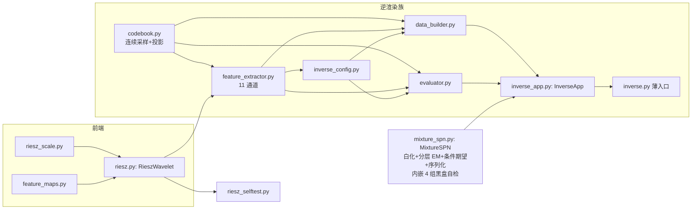

# conger 架构与流程图

SPN 逆渲染研究: cga engine 渲染合成场景 → Riesz 全分辨率特征 → 连续反演
3D 场景参数。本文档是全部流程的总图; 各模块 docstring 有机制细节。

## 0. 主线切换 (2026-08-12)

离散场景码体系 (逐码贝叶斯 CodeBayes / 池化 SPN / 码网格 / 码先验 /
在线 SPN) 已整体退役删除。理由: 位置/尺寸/深度是连续物理量, 离散码
只是后验求积节点; 逐码机制的索引结构就是码本身, 连续任务下不适用。
git 历史保留全部旧实现 (最后一次提交 decbb89..7ae963f 区间)。

现行唯一主线: 连续采样 + 全分辨率浅混合 SPN (MixtureSPN)。

## 1. 主链路 (inverse.py)

实测 (N=4000, K=64): 插值 kind 0.897 / u,v RMSE 6.6px (R²≈0.90) /
z R² 0.44; s/z 弱是物理 (单目单帧仅乘积可观测 = 熟悉尺寸歧义,
R²>0 部分来自边界线索)。外推报告制: 核回归边界饱和不完美
(s/z R² 可为负) —— 核机器上限, 升级路径 mixture of linear experts。

## 2. 关键机制决策 (全是实测驱动的判决)

## 3. 模块结构 (一文件一类)

依赖方向单向; codebook/feature_extractor 仅 TYPE_CHECKING 引
InverseConfig 防环。

## 4. 持久化 (safetensors)

- 数据缓存: `artifacts/mix_*.safetensors` (配置指纹文件名, gitignore);
- 模型: MixtureSPN.save/load —— 参数张量 (含白化基 basis (V,D),
  全量模式约 3GB) + rel_floor 入 JSON 明文头; Utils.st_metadata 可查。
- 注意: 旧 `inv_*`/`fullres_*`/`joint_*` 缓存属已删除的离散体系, 可清。

## 5. 待办 (研究升级路径, 均未做)

- mixture of linear experts: 块内放开特征↔目标交叉协方差
  (治外推边界饱和; 低秩 + SVI)
- DP-SVI 自动定 K (分量数从超参变推断量, 接 structure learning 遗产)
- online EM (数据量超内存时平移; 旧 OnlineSPN 已是其骨肉)
- 训练数据全因子重设计 (光位/光色/图元色组合覆盖; 色恒常歧义对
  拆条件监督 —— 讨论已定调, 未实现)
