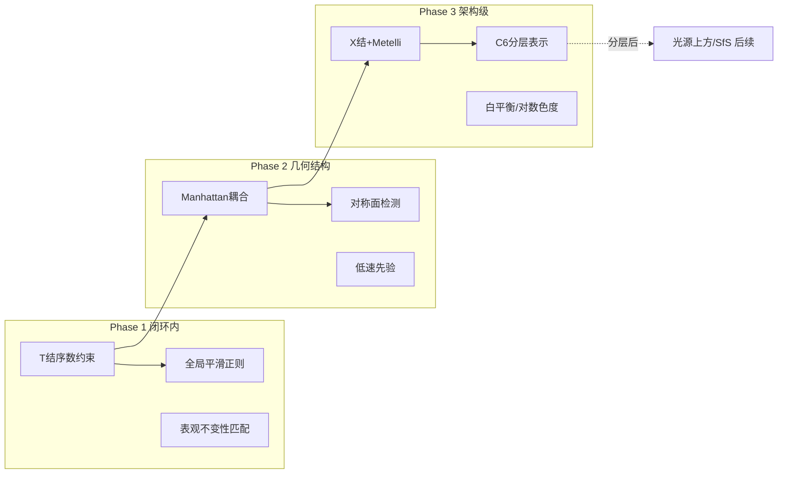

# 先验补齐路线图

来源：`docs/prior.md` 六类先验与代码逐条对账（✓ 7 / ◐ 10 / ✗ 13）。
取舍逻辑：① T 结是 prior.md 点名的最高权重序数先验且检测端已是半成品；
② 光学启示是"归一化必须在特征层"；③ 语义类"纯底层管线不可获得"。
按 **价值 × 已有地基** 排四期。每项落地纪律不变：定向合成世界 + 自检断言、
旧基线逐位不动、ruff/pyright 双零。

## Phase 1 — 闭环内高价值、地基已存在

| 项 | 机制 | 接入点 | 量 |
|---|---|---|---|
| **T 结序数深度约束**（半成品最后一公里） | T 结处 stem 链所属区域=前、被切断链=后 → 单边序数约束 z_前 ≤ z_后，**高精度不可下调**；OrdinalCue 注入融合，冲突时 scenegraph 仲裁也消费 | `grouping.t_junctions`（含跨帧 tj_id）→ 链→区域映射 → `fusion.CueFusion` 半边高斯项 / `scenegraph.accumulate` 仲裁 | M |
| **全局平滑正则**（紧凑性/平滑性正式化） | 稠密深度场边缘感知扩散：∇z 惩罚 × (1−E)，Pb 边界处断开；复用 `edgemap.smooth_normal` 加权模式 | `fusion.CueFusion` 高斯乘积之后、PrimitiveFit 之前 | S |
| **表观不变性匹配项**（直接治 rect1 不稳） | tid/rid 匹配从纯几何（质心/端点）加区域均值颜色/纹理签名项（特征已在 vbgmm） | `GroupingTracker` / `SubregionTracker` 匹配代价 | S |

## Phase 2 — 几何结构（空壳填肉）

| 项 | 机制 | 接入点 | 量 |
|---|---|---|---|
| **ManhattanCoupling** | 场景图平面法向直方图聚类 → 主正交系 → 平面重拟合约束到该系 | `fusion.py` 空壳类，消费 `scenegraph.nodes` | M |
| **对称面检测** | 候选镜像面（节点中分面 + Manhattan 主轴面）→ 反射 versor 共轭 → blade 入射评分配对；低频后台层 | `scenegraph.reflect`（工具已有，检测器留钩） | M |
| **显式低速先验** | twist 幅值 ‖ξ‖ 收缩项（Weiss slow-and-smooth 工程形），孔径问题下偏向低速解释 | `temporal.MotorEKF` 更新步 | S |

## Phase 3 — 分层与光学（架构级，单独立项）

| 项 | 机制 | 接入点 | 量 |
|---|---|---|---|
| **C6 分层表示** | 先 X 结检测（T 结拓扑扩展）+ Metelli 混合定律门（交叉点亮度介于两层才算透明），结点局部解耦 I = L₁ + L₂；像素级多层后验留第二步 | `grouping` X 结扩展 → `segment` 多层 Y 层 → `fusion` 分层渲染 | L |
| **光学先验包** | 灰度世界白平衡 + 对数色度光照不变特征（特征层归一化，prior.md 原话）；光源上方 / shape-from-shading 依赖分层落地后再说 | `color.py` 特征提取入口 | S（白平衡部分） |

## 不建清单（YAGNI，写明理由防复活）

- **语义与经验类全部**：需要识别层，prior.md 自己说"纯底层管线不可获得"——等识别层存在再开低频通道
- **大气透视**：文档标注近距无效
- **立体视差**：单目管线
- **重力/支撑、视平线、Geon 识别、一般视角、凸偏好**：收益模糊或依赖语义层
- **聚焦/模糊线索**：无 defocus 数据源

## 依赖顺序

Phase 1 三项彼此独立可并行；开工顺序：T 结序数约束 → 表观不变性 → 全局平滑。

## 进度

- [x] Phase 1.1 T 结序数深度约束 —— `fusion.OcclusionOrder`（链→区域几何映射 + KKT 半空间投影，高权重不可下调），已接入 realtime 闭环；fusion 测试 7/8 验证违序投影/满序不动/几何映射
- [x] Phase 1.2 表观不变性匹配项 —— **仅区域侧落地**（`SubregionTracker` app 参数：区域均值签名，全局 σ 归一，几何硬门内破平局；segment 交叉反转测试+对照验证）。**链侧阴性结果已回滚**：类别似然随 vbgmm online 适应漂移 + 同类链签名无区分度 → 稳定 tid 13→7，几何匹配恢复（阴性结果与教训写进 `grouping._match` docstring）
- [x] Phase 1.3 全局平滑正则 —— `fusion.EdgeAwareSmooth`（E_data+λE_smooth 加权 Jacobi 扩散，w=1−E_边界 边界断开，数据项权重=融合精度），插在 CueFusion 后 PrimitiveFit 前，realtime 以 enh 为边界图接入。效果：EKF 稳态 0.0433→**0.0408**（真值 0.04），末段振荡 ±0.02→±0.003；realtime 断言从「首帧有效估计」改为「末 4 帧稳态均值」（过渡期超调是 EKF 本性）；fusion 测试 9 验证区域内降噪/边界阶梯保持/无边界对照渗漏
- [x] Phase 2.1 ManhattanCoupling —— 空壳填肉（`fusion.ManhattanCoupling`）：深度图退化为两规则——平行吸附（组内加权均值法向）+ 正交吸附（各反向旋一半残差，小角+抛光），质心锚点保深度，无证据逐位不动；`run(manhattan=True)` 开关，默认关；fusion 测试 10 四项（含 flag 通路冒烟）
- [x] Phase 2.2 对称面检测 —— `scenegraph.detect_symmetry(rid_map)`：角平分面闭式候选（(n₁∓n₂)·x=d₁∓d₂，d 须预除 |nm|——Plane 构造只归一法向不缩放 d）+ **支撑城重叠真门**（定理：任意两平面关于角平分面精确镜像，blade 验证恒真无鉴别力）；球-球对称留钩；scenegraph 测试 6
- [x] Phase 2.3 显式低速先验 —— `MotorEKF.r_slow`（零速度伪观测，信息形式 +I/r_slow、残差 −ξ/r_slow）：噪声下收缩、干净对应偏置可略；默认关（无双义场景不付代价），孔径/低纹理场景开启
- [x] Phase 3.1 X 结 + Metelli 门 —— `grouping.XJunction`（双臂皆通的交叉，detect_t_junctions 顺带产出，含切向）+ `MetelliGate.validate`（四扇区采样，混合定律两检验：压缩比 r∈(0,1) + 层反照率 t 合法；**固有歧义**：多归属可同合法 → 全收集按裸侧对比度降序）。12.png 基线 T=78 不动并检出 1 个真实 X 结；消费者是 3.2 分层解耦（接线留到 3.2）
- [x] Phase 3.2 C6 分层表示 —— 第一片 `grouping.LayerSeparator`（结点局部解耦）+ 完整版 `layers.LayeredPosterior`（**像素级多层后验**：逐像素覆盖度 α(p)=(I−B̂)/(t−B̂)，B̂ 独立于锚点参数由裸区内绘估计——锚点恢复是循环论证，实测 α≡ᾱ；消费者：base 去遮替代图 + suppress 遮层边界抑制）。渐变遮层恢复：相关 1.00、偏差 0.010。已知限制：渐变背景的内绘偏差（纯扩散抹平梯度）。**剩余**：fusion 分层渲染/scenegraph 多层节点（消费端形状改造）
- [x] Phase 3.3 光学先验包 —— `Color.gray_world_wb`（灰度世界白平衡，保总亮度）+ `Color.log_chromaticity`（log(R/G),log(B/G) 光照不变特征，强度缩放在对数域相消）；color.py 补自检（暖色偏校正散布 0.0000、强度不变 1e-7、表面可分）。接入主流水线需彩色入口（当前管线灰度），留待有彩色需求时
